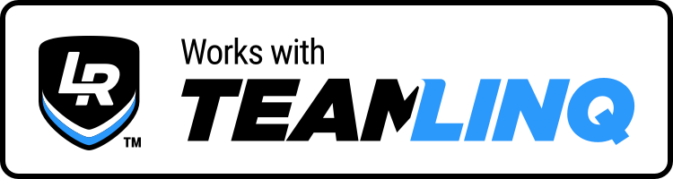

Create your own Dashboards or Applications using TeamLINQ's SimHub Properties.
{: .fs-6 .fw-300 }

## What is TeamLINQ
TeamLINQ enables real-time sharing of SimHub telemetry among teammates[^1]. Its intuitive interface makes team racing feel more authentic than ever.

[**Learn more about TeamLINQ**](https://lsr.gg/teamlinq)

### 1. Real-time Telemetry sharing
TeamLINQ properties act as a proxy between SimHub's native properties and your Dashboard or Application. The same properties work as you'd expect them to work when running a local session, but also deliver your teammate's telemetry when enabled.

### 2. Smart Property Mapping
TeamLINQ properties also make it easier to build your project as it internally resolves them to the correct data source, ensuring your dashboard works seamlessly across multiple games without reconfiguration.

### 3. Remote & Local Telemetry
The Lovely Plugin introduces a set of new properties which mirror the native Simhub data. When TeamLINQ is enabled and you have selected to observe a driver in your team, the same properties will deliver streaming data in real-time from your selected teammate's Simhub.

{: .highlight .my-6 }
> The same TeamLINQ properties are used across all sims, and for both local and remote telemetry.
> 
> {: .note .green }
> **Use** - `LovelyPlugin.TeamLINQ.Vehicle.TC`
> 
> instead of:
> 
> {: .note .red }
> **ACC** - `DataCorePlugin.GameRawData.Graphics.TCCut` 
> 
> {: .note .red }
> **iRacing** - `DataCorePlugin.GameRawData.Telemetry.dcTractionControl2`

## Free & Paid versions

{: .important .mt-3 }
> * Using TeamLINQ is **absolutley free** and **does not require a membership** or **account**. By including it in your projects you can take advantage of the TeamLINQ Property benefits.
> * **Real-time Telemetry sharing** on the other hand does require a [Team Pro Membership](https://store.lsr.gg/pages/business-solutions-teams-monthly), and it unlocks for all members of the team.

## Calling all Sim Racing Developers
Your dashboards and applications are already impressive - now take them to the next level by integrating TeamLINQ's properties. Unlock real-time data sharing and transform how teams experience your work.

{: .mt-5 }

{: .mb-2 }

{: .mt-0 }
### Showcase that your product Works with TeamLINQ
Whether you're designing a dashboard, building an application, or converting your team's secret stint calculator, TeamLINQ makes it instantly accessible to every teammate. And when your creation harnesses TeamLINQ's features, you can display our official "Works with TeamLINQ" badge—letting the community know they can use your product together, in real-time.
{: .mb-4 }

[**Download Badge**](https://lsr.gg/TeamnLINQBadgeDL){: .btn .btn-blue .mr-4  }

## Security
All data payloads are optimised, obscured and transferred over a secure connection in real-time. We do not store or have access to your data at any point in time.

---

[^1]: **Team Pro Membership Required** - TeamLINQ Real-time telemetry sharing requires a [Team Pro Membership](https://store.lsr.gg/pages/business-solutions-teams-monthly) during the Beta phase. As the product evolves, we will continue evaluating our options for broader access. 